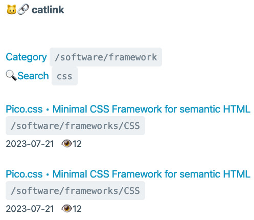

# v0.1.0 – codename: "La Gata Lola" (in-progress...)

This first release is focused on the core functionalities of the search engine (Full-text search):

- create database migrations:
  - `users` (username, password, profile_link, role, state, token)
  - `links` (category, url, html, title, description, og_image, views, user_id, state)
- create model:
  - `User`
  - `Link`
- create controllers:
  - `AdminController`
  - `LinkController`
  - `LoginController`
- create middleware: `CheckRole`
- create Blade views:
  - [home](https://laravista.altervista.org/CatLink/)
  - [categories](https://laravista.altervista.org/CatLink/categories)
  - [search](https://laravista.altervista.org/CatLink/search)
  - [link detail](https://laravista.altervista.org/CatLink/links/1)
  - [originl HTML](https://laravista.altervista.org/CatLink/links/1/html)
  - [comments](https://laravista.altervista.org/CatLink/links/42/comments)
  - [about](https://laravista.altervista.org/CatLink/about)
  - [cookie](https://laravista.altervista.org/CatLink/cookie)
  - [register](https://laravista.altervista.org/CatLink/register/351f359f-1a84-45be-b0a4-431d4f374b8a) with token, without (or consumed) we have a 404 Not Found
  - [login](https://laravista.altervista.org/CatLink/login)
  - [link add](https://laravista.altervista.org/CatLink/link_add) for logged user
  - [logout](https://laravista.altervista.org/CatLink/logout)
  - [admin home](https://laravista.altervista.org/CatLink/admin/home)
  - [admin editor](https://laravista.altervista.org/CatLink/admin/editor) useful for hidden files (.env) on AlterVista
  - [admin link update](https://laravista.altervista.org/CatLink/admin/link_update/38)

## Database Migration

Inside Docker execute:

```
root@7fc82e008715:/var/www/html/CatLink# php artisan make:migration create_links_table

   INFO  Migration [database/migrations/2023_07_22_232301_create_links_table.php] created successfully.
```

execute migrations (only to make a test)

```
root@7fc82e008715:/var/www/html/CatLink# php artisan migrate

   INFO  Running migrations.  

  2014_10_12_100000_create_password_reset_tokens_table ......................................................................... 113ms DONE
  2019_08_19_000000_create_failed_jobs_table .................................................................................... 44ms DONE
  2019_12_14_000001_create_personal_access_tokens_table ......................................................................... 35ms DONE
  2023_07_22_232301_create_links_table .......................................................................................... 13ms DONE
```

Note: `2014_10_12_000000_create_users_table` already exists because the local database is the copy of production

To refresh only a specific file use this:

```
php artisan migrate:refresh --path="database/migrations/2023_07_22_232301_create_links_table.php"
```

Now this is the last (batch) and you can use the classic `php artisan migrate:rollback`

```
root@0e5ad5d418f8:/var/www/html/CatLink# php artisan migrate:rollback

   INFO  Rolling back migrations.  

  2023_07_22_232301_create_links_table ................................................................................................... 86ms DONE

root@0e5ad5d418f8:/var/www/html/CatLink# php artisan migrate         

   INFO  Running migrations.  

  2023_07_22_232301_create_links_table .................................................................................................. 101ms DONE
```

To see the migraton SQL you have to rollback end execute `php artisan migrate --pretend`

```
  2023_07_22_232301_create_links_table .............................................................................................................  
  ⇂ create table `links` (`id` bigint unsigned not null auto_increment primary key, `category` varchar(100) not null, `url` varchar(2000) not null, `html` longtext null, `title` varchar(100) null, `description` varchar(500) null, `og_image` varchar(2000) null, `views` int not null default '0', `created_at` timestamp null, `updated_at` timestamp null) ENGINE=InnoDB default character set utf8mb4 collate 'utf8mb4_unicode_ci'  
  ⇂ ALTER TABLE links ADD FULLTEXT links_html_index (html)  
```

💡 Note: this is a possible **workaround** for the issue [#1](https://github.com/rognoni/catlink/issues/1)

## Link (model)

Inside Docker execute:

```
root@7fc82e008715:/var/www/html/CatLink# php artisan make:model Link --controller

   INFO  Model [app/Models/Link.php] created successfully.  

   INFO  Controller [app/Http/Controllers/LinkController.php] created successfully.
```

## Blade (home)


